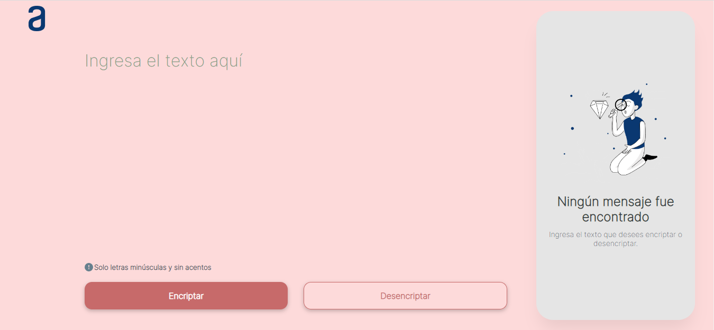

# Encriptador de Texto

Este proyecto es parte del Challenge ONE - Oracle + Alura Latam, donde se desarrolló un encriptador de texto en lenguaje JavaScript, HTML5 y CSS3. El encriptador utiliza las siguientes reglas:

- La letra "e" es convertida para "enter"
- La letra "i" es convertida para "imes"
- La letra "a" es convertida para "ai"
- La letra "o" es convertida para "ober"
- La letra "u" es convertida para "ufat"

## Requisitos

El encriptador de texto debe cumplir con los siguientes requisitos:

- Funcionar solo con letras minúsculas.
- No utilizar letras con acentos ni caracteres especiales.
- Permitir la conversión de una palabra a su versión encriptada y viceversa.

### Funcionalidades adicionales

- Permitir copiar el texto encriptado/desencriptado a través de un botón con la misma funcionalidad del comando "ctrl+c" o la opción "copiar" del menú de las aplicaciones.

## Vista Previa

Haz clic en la imagen para acceder al encriptador de texto:

